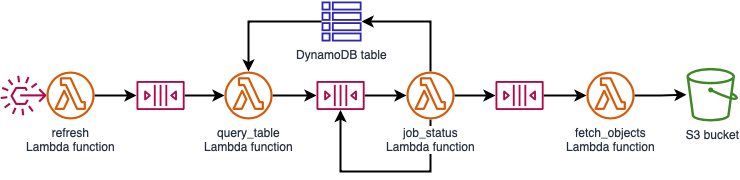

# canvas-data-2

This project contains source code and supporting files for a serverless application that you can use to download and maintain warehouse of Canvas Data 2 extracts.
You can deploy this application to your AWS account with the SAM CLI. It includes the following files and folders.

- `refresh` - Code for a Lambda function that starts the workflow.
- `query_table` - Code for a Lambda function that queries the DAP API for a table.
- `job_status` - Code for a Lambda function that checks the status of a query job.
- `fetch_objects` - Code for a Lambda function that downloads files when a query job is succesfully completed.
- template.yaml - A template that defines the application's AWS resources.

The application uses several AWS resources, including Lambda functions, SQS queues, a DynamoDB table, and an S3 bucket. These resources are defined in the `template.yaml` file in this project.



## Deploy the canvas-data-2 application

The Serverless Application Model Command Line Interface (SAM CLI) is an extension of the AWS CLI that adds functionality for building and testing Lambda applications. It uses Docker to run your functions in an Amazon Linux environment that matches Lambda. It can also emulate your application's build environment and API.

To use the SAM CLI to deploy this application, you need the following tools.

* SAM CLI - [Install the SAM CLI](https://docs.aws.amazon.com/serverless-application-model/latest/developerguide/serverless-sam-cli-install.html)
* [Python 3 installed](https://www.python.org/downloads/)

To build and deploy your application for the first time, run the following in your shell:

```bash
sam build
sam deploy --guided
```

The first command will build the source of your application. The second command will package and deploy your application to AWS, with a series of prompts:

* **Stack Name**: The name of the stack to deploy to CloudFormation. This should be unique to your account and region, and a good starting point would be something matching your project name.
* **AWS Region**: The AWS region you want to deploy your app to.
* **Confirm changes before deploy**: If set to yes, any change sets will be shown to you before execution for manual review. If set to no, the AWS SAM CLI will automatically deploy application changes.
* **Allow SAM CLI IAM role creation**: Many AWS SAM templates, including this example, create AWS IAM roles required for the AWS Lambda function(s) included to access AWS services. By default, these are scoped down to minimum required permissions. To deploy an AWS CloudFormation stack which creates or modifies IAM roles, the `CAPABILITY_IAM` value for `capabilities` must be provided. If permission isn't provided through this prompt, to deploy this example you must explicitly pass `--capabilities CAPABILITY_IAM` to the `sam deploy` command.
* **Save arguments to samconfig.toml**: If set to yes, your choices will be saved to a configuration file inside the project, so that in the future you can just re-run `sam deploy` without parameters to deploy changes to your application.


## Cleanup

To delete the application that you created, use the AWS CLI. Assuming you used your project name for the stack name, you can run the following:

```bash
aws cloudformation delete-stack --stack-name canvas-data-2
```

Alternatively, you can delete the stack in the CloudFormation console (within the AWS web console).
